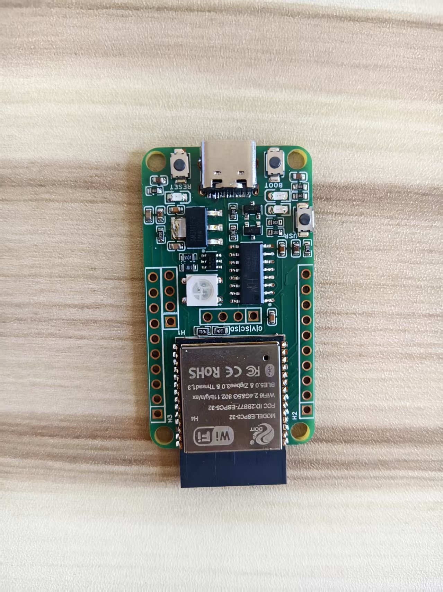
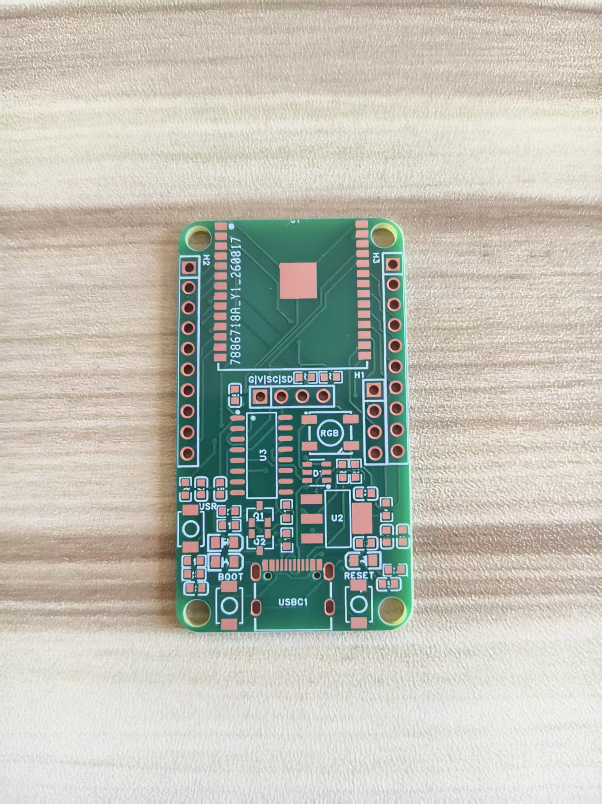
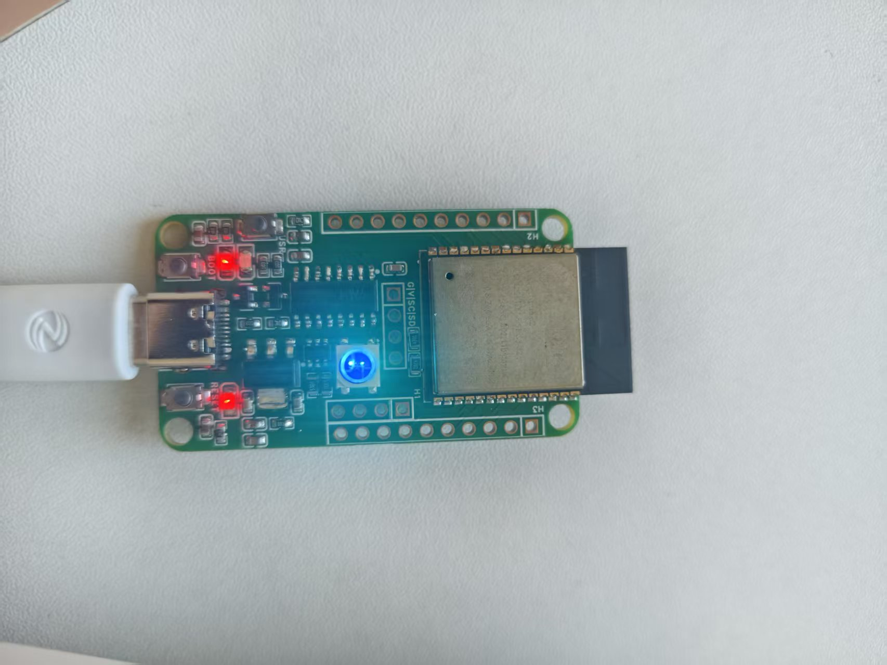

# ESP32-C5 最小系统板

基于 **嘉立创EDA专业版** 设计的 ESP32-C5 最小系统板，从原理图、PCB 打样到焊接验证全链路闭环。



---

## 硬件特性

| 模块 | 说明 |
|------|------|
| **主控** | ESP32-C5-WROOM（乐鑫 Wi-Fi 6 + BLE 5.3 模组，内置 32-bit RISC-V 处理器） |
| **供电** | USB Type-C 5V 输入 → AMS1117-3.3 LDO 稳压 → 3.3V 系统供电 |
| **自动下载** | CH340C USB 转串口 + DTR/RTS 自动下载电路，无需手动按 BOOT/EN |
| **人机交互** | 1× 用户按键、1× BOOT 按键、1× RESET 按键、1× WS2812B RGB LED |
| **显示** | 4Pin I2C OLED 接口（SSD1306/SH1106 兼容，SDA→IO2 / SCL→IO3，板上已贴 4.7k 上拉） |
| **扩展** | 双侧 2.54mm 排针引出剩余 GPIO（IO12~IO21 等），含 3.3V/GND |
| **串口** | 独立 4Pin 串口排针（5V/GND/TX/RX），方便外接传感器或从机 |

---

## 原理图说明

### 1. 主控电路
- ESP32-C5-WROOM 模组以 3.3V 供电，EN 引脚通过 10k 上拉电阻默认使能芯片。
- 模组所有可用 GPIO 均已通过排针或功能电路引出，避免资源浪费。

### 2. Type-C & CH340C 自动下载
- **Type-C 接口**（USBC6-29C6B）支持正反插，CC 引脚通过 5.1k 下拉电阻识别电源角色。
- **CH340C** 内置时钟源，无需外部晶振，TX/RX 分别连接模组 UART 引脚。
- **自动下载电路**：利用 CH340C 的 DTR/RTS 信号，经三极管（Q1/Q2）分别控制 EN 与 BOOT（IO9），配合电容产生脉冲时序，实现“一键下载”。

### 3. 电源电路
- **AMS1117-3.3**（U2）提供最大 1A 输出能力，满足模组峰值发射电流需求。
- 输入/输出端均配置多级去耦电容（10μF + 100μF），抑制 USB 电源纹波与负载瞬变。
- 电源指示灯通过限流电阻接 3.3V，上电即亮，便于快速排查供电故障。

### 4. OLED 与 RGB
- OLED 座子为 4Pin I2C 接口，SDA/SCL 分别接 IO2/IO3，板上已集成 4.7k 上拉，用户可直接插屏使用。
- WS2812B（5050 封装）单线驱动，数据脚接 IO6，通过 1k 串联电阻抑制信号反射，兼容 FastLED / NeoPixel 等主流库。

### 5. 按键与排针
- **BOOT 按键**：接 IO9，配合自动下载电路，也可在固件中作为用户输入。
- **RESET 按键**：接 EN，硬件复位。
- **用户按键**：接独立 GPIO，用于应用层交互。
- 双侧排针按顺序引出 IO12~IO21 及电源地，方便接入面包板或杜邦线扩展。

---

## PCB 设计要点

- **板型**：圆角矩形，四角预留 M3 安装孔，便于机械固定。
- **层数**：双层板，红色阻焊，底层大面积覆铜（GND），顶层信号线尽量短直。
- **天线区域**：ESP32-C5 模组天线区下方无铜、无走线，保证射频性能。
- **电源完整性**：AMS1117 输入/输出电容就近放置，减小回路面积；USB 5V 走线加粗至 20mil 以上。
- **USB 差分**：Type-C D+/D- 差分走线等长等距，经 ESD/TVS 器件后进入 CH340C。
- **丝印**：关键接口（BOOT、RESET、RGB、USB、OLED）均带中文丝印，降低调试门槛。

---

## 使用说明

1. **开发环境**：Arduino IDE / PlatformIO / ESP-IDF / MicroPython 均可。
2. **驱动安装**：首次使用需安装 CH340C 驱动（Windows 通常自动识别）。
3. **下载固件**：插上 Type-C 数据线，在 IDE 中点击“上传”，自动下载电路会自动拉低 BOOT 并复位，无需手动按键。
4. **OLED 测试**：接入 0.96" I2C OLED，运行 U8g2/Adafruit_SSD1306 示例即可点亮。
5. **RGB 测试**：运行 NeoPixel 示例，IO6 输出即可控制 WS2812B 颜色与亮度。

---

## 实物展示

| PCB 裸板 | 成品板 | 效果 |
|----------|--------|------|
|  |  |  |

---

## 设计工具

- **原理图 / PCB**：嘉立创EDA专业版（`.epro2`）
- **版本**：V1.0
- **创建日期**：2026-08-15
- **更新日期**：2026-08-16

---

## 文件清单

```
ESP32-C5原理图.png                          # 完整原理图截图
ESP32-C5PCB板图.png                         # PCB 顶层/底层渲染图
ESP32C5最小系统板_最终版（嘉立创EDA专业版）.epro2   # 源工程文件
PCB裸板.jpg                                 # 打样回来的裸板照片
成品板.jpg                                   # 焊接完成后的成品照片
效果.jpg                                     # 上电运行效果照片
```

---

## License

MIT License — 开源硬件，欢迎二次设计与改进。
